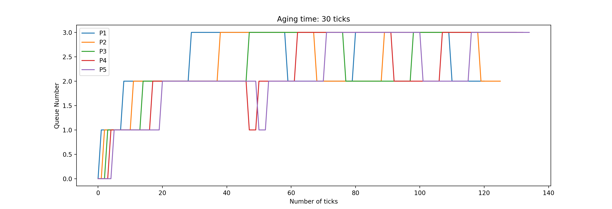
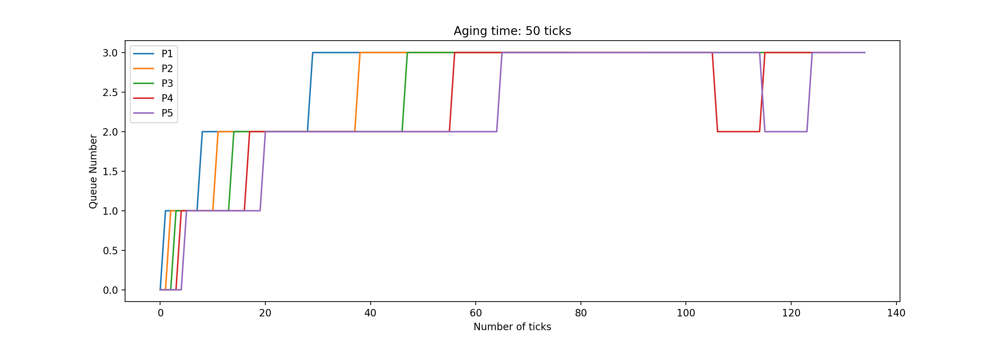
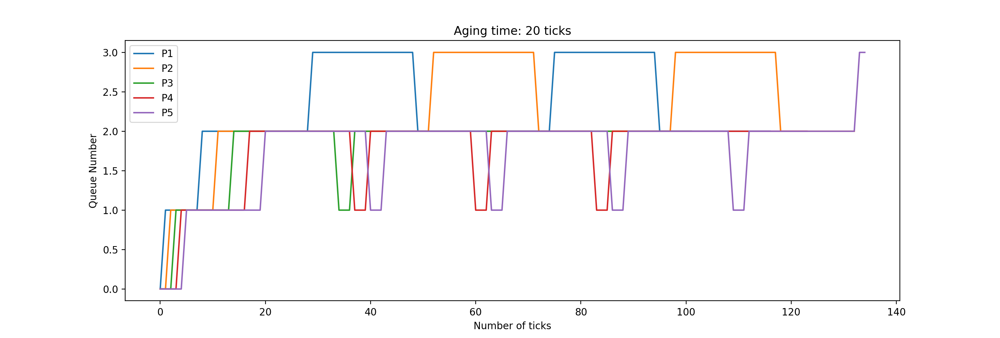
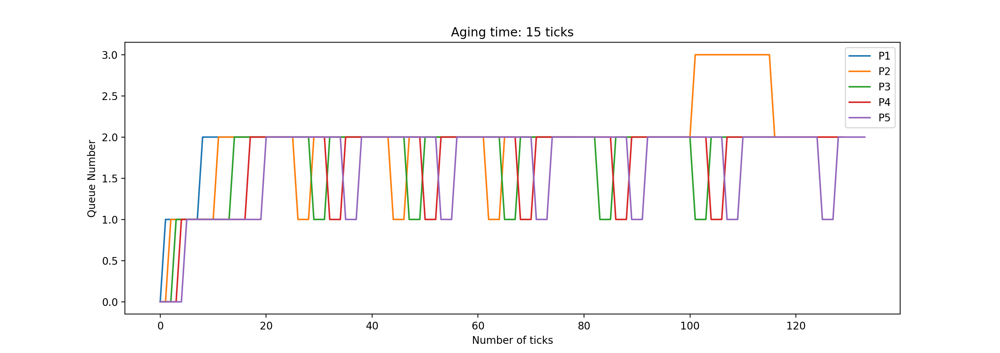

# Report - Scheduling

## Scheduling Overview

The `main.c` file calls the `scheduler()` function in `kernel/proc.c` which is a non-returning function that schedules the processes to be run.

`proc` is a global array containing the `struct proc` for all the processes. `NPROC` is a macro defining the maximum number of processes that can be present in the os (64 in xv6). Since multiple cpu cores might be accessing a particular `struct proc` at the same time, we always have to `acquire` and `release` the `lock` of the struct proc before making any changes to it’s attributes. The `scheduler()` function decides the process to be run and makes a `swtch` call which is written in assembly that saves the context of the registers from the process to the cpu and runs the process thread. 

The `ticks` global variable is used to store the current time which is incremented every clock cycle.

The `yield()` function is a system call that allows a process to voluntarily give up the CPU at the end of each tick in order to allow other processes to run. It pauses the current process by setting its state to `RUNNABLE` and calls `sched()` which in-turn calls `swtch` that saves the context of the registers from the cpu to the process and switches to the scheduler thread where the `scheduler()` function continues running.

## Round Robin (RR)

This is the **default** scheduler implemented in xv6 (No changes made)

```c
for (p = proc; p < &proc[NPROC]; p++)
{
		acquire(&p->lock);
    if (p->state == RUNNABLE)
    {
	      p->state = RUNNING;
	      c->proc = p;
	      swtch(&c->context, &p->context);
	      c->proc = 0;
    }
    release(&p->lock);
}
```

The loop iterates through all the processes and schedules the first `RUNNABLE` process by changing it’s state and calling `sched`. After every tick the `yield()` call is made by the process which gives up the cpu and returns to the `scheduler()` function, where the next `RUNNABLE` process is chosen and the same process repeats. Therefore, the given code simulates a **Round Robin** like behaviour with a **time slice of 1 tick.**

## First Come First Serve (FCFS)

The scheduling policy states that we need to schedule the processes in order of their creation time and the scheduled process should continue running till it no longer needs the CPU. 

We first start by iterating through all the processes and get the process with the minimum `ctime` where `ctime` is an attribute of each `struct proc` and stores the creation time of the process. This process with minimum `ctime` is stored in a variable `processToRun`. If this variable does not contain a valid process, then we skip the scheduling part and restart the process.

```c
// get the process with minimum ctime
for (p = proc; p < &proc[NPROC]; p++)
{
	  acquire(&p->lock);
	  if (p->state == RUNNABLE && p->ctime < min_ctime)
	  {
		    min_ctime = p->ctime;
		    processToRun = p;
	  }
	  release(&p->lock);
}
if (processToRun == 0)
{
	  continue;
}
```

Now, we need to schedule the process, which is done by first acquiring the lock → changing the process’ state to `RUNNING`  → changing cpu’s process to **processToRun** → and then finally calling `swtch` . The lock is released after the process has completed it’s execution

```c
acquire(&processToRun->lock);
if (processToRun->state == RUNNABLE)
{
	  processToRun->state = RUNNING;
	  c->proc = processToRun;
	  swtch(&c->context, &processToRun->context);
		// control returns here after process has completed
	  c->proc = 0;
}
release(&processToRun->lock);
```

Now, we need to disable preemption of the running process after clock interrupts. This is done by ignoring the call to `yield()` in the `kerneltap()` and `usertrap()` methods in `kernel/trap.c`. This is accomplished using pre-processor directives which define the type of scheduling policy to be used. In case of `FCFS`, nothing is done, basically ignoring the timer interrupt.

```c
#ifdef MLFQ
    updateAndyield(myproc());
#endif
#ifdef RR
    yield();
#endif
```

This allows the process to run continuously on the CPU until it either finishes or issues some other type of trap instruction like I/O to the OS.

Therefore the entire concept of FCFS has been implemented where the process is **scheduled based on the lowest creation time** and runs until it **no longer needs the CPU.**

## Multi Level Feedback Queue (MLFQ)

The scheduling policy states that we need to implement 4 queues and assume process are assigned a queue based on it’s priority. If the process while running relinquished the CPU after the current queue’s time slice, then it is kept at the same priority level and added to the end of the same queue. Instead if the process did not relinquish the CPU, it should get demoted to a lower priority queue. Aging also has to be implemented in order to prevent starvation.

The following rules define the MLFQ policy -

1. On the initiation of a process, push it to the end of the highest priority queue.
2. You should always run the processes that are in the highest priority queue that is not empty.
3. A round-robin scheduler should be used for processes at all priority queue.
4. If the process uses the complete time slice assigned for its current priority queue, it is preempted and inserted at the end of the next lower level queue.
5. If a process voluntarily relinquishes control of the CPU(eg. For doing I/O), it leaves the queuing network, and when the process becomes ready again after the I/O, it is inserted at the tail of the same queue, from which it is relinquished earlier
6. To prevent starvation, implement aging of the processes.

Firstly, new attributes were added to the `struct proc` in `kernel/proc.h` - `priority`, `entryTimeInQueue`, `waitTimeInQueue`, `runTimeInQueue`. The variable `priority` stores which queue it belongs to with 0 being the highest and 3 being the lowest.

```c
struct proc
{
		: // original attributes
		// for mlfq
	    int priority;
        uint entryTimeInQueue;
        uint waitTimeInQueue;
        uint runTimeInQueue;
}
```

**(Rule 1)** 

When a new process is created, we need to assign it the highest priority **0**. The **waitTime** and **runTime** are **0** and the  **entryTime** is given by the **ticks** variable, as the process just gets added to the queue. These are added in the `allocproc()` method where the process’ struct proc gets initialised.

```c
static struct proc *
allocproc(void)
{
	  : // original initializations
	  // mlfq init
	  p->priority = 0;
	  p->entryTimeInQueue = ticks;
	  p->waitTimeInQueue = 0;
	  p->runTimeInQueue = 0;

	  return p;
}
```

**(Rule 2 and 3)**

The function `getHighestPriorityProc()` in `kernel/proc.c` returns the process to be scheduled. It finds the process with the least priority number (highest priority) and in case of processes with equal priority number, the `entryTimeInQueue` variable of the `struct proc` is considered. This accounts for round robin in the highest priority queue as well.

```c
struct proc *getHighestPriorityProc()
{
  struct proc *p;
  struct proc *retVal = 0;

  for (p = proc; p < &proc[NPROC]; p++)
  {
    if (p->state == RUNNABLE)
    {
      if (retVal == 0)
      {
        retVal = p;
      }
      else
      {
        if (retVal->priority > p->priority)
        {
          retVal = p;
        }
        else if (retVal->priority == p->priority && p->entryTimeInQueue < retVal->entryTimeInQueue)
        {
          retVal = p;
        }
        else
        {
        }
      }
    }
  }
  return retVal;
}
```

**(Rule 4)**

At the end of each tick, instead of calling the `yield()`function by default, a new function `updateAndYield()` has been created. This function increments the runTimeInQueue for the currently running process and the **waitTimeInQueue** for all other RUNNABLE processes by calling the `increaseWaitTime()` function.

The `preventStarvation()` function is also called to prevent aging. It returns the highest new queue number of any process that might have been boosted.

After this we check if the current **runTimeInQueue** is more than the assigned time slices for the current priority. If yes, then the **runTimeInQueue** and **waitTimeInQueue**  are reset to 0, and the **entryTimeInQueue** is set to the current ticks. The priority is lowered if it is not already in the lowest queue and then `yield()` is called which gives control back to the scheduler thread after its call to `swtch`.

```c
void increaseWaitTime()
{
  struct proc *p;

  for (p = proc; p < &proc[NPROC]; p++)
  {
    if (p->state == RUNNABLE)
    {
      acquire(&p->lock);
      p->waitTimeInQueue++;
      release(&p->lock);
    }
  }
}

void updateAndyield(struct proc *p)
{
  int queueTimeouts[4] = {1, 3, 9, 15};
  p->runTimeInQueue++;
  increaseWaitTime();
  int change = preventStarvation();

  if (p->runTimeInQueue >= queueTimeouts[p->priority])
  {
    acquire(&p->lock);
    if (p->priority != 3)
    {
      p->priority++;
    }
    p->runTimeInQueue = 0;
    p->entryTimeInQueue = ticks;
    p->waitTimeInQueue = 0;
    release(&p->lock);
    yield();
  }
  else{
    if (change < p->priority)
    {
      yield();
    }
  }
}
```

**(Rule 5)**

In case the process issues an I/O before finishing its time slice, then the interrupt `yield()` is not reached . Instead the control goes to the `sleep()` function in `kernel/proc.c` where the state is changed to **SLEEPING.** Along with this, code has been added to reset the **runTimeInQueue** and **waitTimeInQueue** to 0 and the **entryTimeInQueue** is set to the current ticks. The control then calls the `sched()` function which in-turn calls `swtch` handling control back to the scheduler thread. Since, the state is now **SLEEPING**, it does not get scheduled again as scheduler looks only for **RUNNABLE** processes.

When the process is done with its I/O, the `wakeup()` function in `kernel/proc.c` is called which sets the state of the process to **RUNNABLE** and sets the **entryTimeInQueue** to be equal to the number of ticks. The priority is not changed, so essentially, the process gets added at the end of the same queue.

```c
void sleep(void *chan, struct spinlock *lk)
{
		: //original code
		// Go to sleep.
	  p->chan = chan;
	  p->state = SLEEPING;
	  
	  // mlfq 
	  p->runTimeInQueue = 0;
	  p->entryTimeInQueue = ticks;
	  p->waitTimeInQueue = 0;
}

void wakeup(void *chan)
{
		: // original code
		p->state = RUNNABLE;
    // mlfq
    p->entryTimeInQueue = ticks;
}
```

**(Rule 6)**

In order to prevent starvation, after every 30 ticks, the priority of the process is increased. The `preventStarvation()` function in `kernel/proc.c` cycles through all processes and if the **waitTimeInQueue** is more than **30 ticks**, then the priority is increased and the **wait** and **run** time are reset to 0, and the **entry** time in the new queue is set to the current ticks.

The function returns the new highest priority number to which a process has been boosted. This is useful in the `updateAndYield()` function to schedule the new process if the return value is greater than the current process’ priority.

```c
int preventStarvation()
{
  struct proc *p;
  int retVal = 4;

  for (p = proc; p < &proc[NPROC]; p++)
  {
    if (p->state == RUNNABLE)
    {
      if (p->waitTimeInQueue >= 30 && p->priority != 0)
      {
        acquire(&p->lock);
        p->priority--;
        p->waitTimeInQueue = 0;
        p->entryTimeInQueue = ticks;
        p->runTimeInQueue = 0;
        release(&p->lock);
        retVal = retVal<p->priority? retVal:p->priority;
      }
    }
  }
  return retVal;
}
```

**The Scheduler Function**

The function first prevents starvation by calling the `preventStarvation()` function. It then selects the `processToRun` using the `getHighestPriorityProc()` function which determines the process to run based on Rules 2 and 3. If the **processToRun** is 0 (not defined), the code reruns. Otherwise, the `processToRun` is scheduled by first updating its details like **state** to **RUNNING**, **wait** and **run** time to 0 and **entry** time to current ticks. The `swtch` function is then called which schedules the process.

```c
void scheduler(void)
{
		preventStarvation();
		struct proc *processToRun = getHighestPriorityProc();
		if (processToRun == 0)
		{
			  continue;
		}
		if (processToRun->state == RUNNABLE)
		{
			  acquire(&processToRun->lock);
			  processToRun->state = RUNNING;
			  processToRun->waitTimeInQueue = 0;
			  processToRun->entryTimeInQueue = ticks;
			  processToRun->runTimeInQueue = 0;
			  c->proc = processToRun;
			
			  swtch(&c->context, &processToRun->context);
			
			  c->proc = 0;
			  release(&processToRun->lock);
		}
}
```

Therefore, the MLFQ policy has been implemented satisfying the 6 rules.

## Performance Comparison

The `schedulertest` creates 5 interactive cpu-intensive jobs and 5 I/O bound jobs. Following are the results for 1 CPU -

| Scheduler | CPUs | rtime | wtime |
| --- | --- | --- | --- |
| RR | 1 | 13 | 153 |
| FCFS | 1 | 13 | 128 |
| MLFQ | 1 | 13 | 147 |

(MLFQ priority boost time - 30 ticks)

The `rtime` (total run time) is same in all cases as the total CPU time used by the processes is independent of the scheduling algorithm.

The `wtime` (total wait time) is the main differentiating factor-

- RR has the highest **wtime** indicating that the processes spend a lot more time waiting to get scheduled due to the very low time slice
- FCFS has the lowest **wtime** as the cpu bound processes get immediately or as soon as possible control of the cpu
- MLFQ has an average **wtime** as the algorithm itself is a combination of RR and FCFS. High priority jobs are quickly finished whereas lower priority jobs undergo round robin unless boosted.

## MLFQ Graph

The code for plotting the graph has been given in the `initial-xv6/results` folder

To generate the graph -

1. Uncomment line 169 in `kernel/proc.c` which enables the `saveToFile()` function. The function only prints all the process’ pid, priority and state at every tick.
2. Copy the output to `results/mlfqResults`. Remove the redundant lines.
3. Run `printGraph.py` which plots the given graph
- Aging Time: 30 ticks
    
    
    
    Average rtime 13, wtime 151
    
- Aging Time: 50 ticks
    
    
    
    Average rtime 13, wtime 142
    
- Aging Time: 20 ticks
    
    
    
    Average rtime 13, wtime 147
    
- Aging Time: 15 ticks
    
    
    
    Average rtime 13, wtime 145