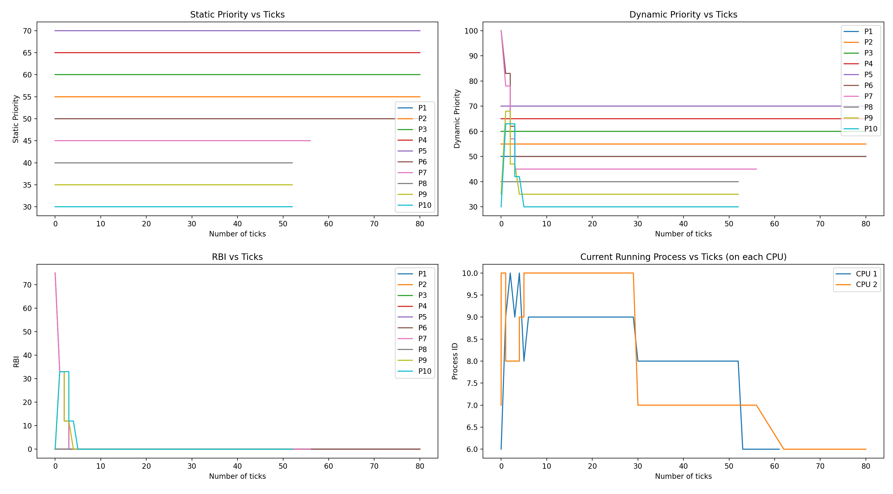

# Report - PBS

## Basic Implementation Idea

Parameters - *staticPriority*, *dynamicPriority*, *rbi*,  *timesScheduled*, *startTime*, *runTime*, *waitTime*, *sleepTime* have been added to each `struct proc` The default values of 50 for *staticPriority* and 25 for *rbi* along with other initialisations have been done in `allocproc()` function. Functions for calculating RBI and DP have been implemented in `kernel\proc.c`. At the end of each tick, `updatePBSParams()` is called which updates these parameters based on the process state for all the processes. When `yield()` gets called, the scheduler gets the process to be scheduled using the `getProcessToBeScheduled()` function which decides process on lower value of dynamic priority → more times scheduled → earlier creation time. The `scheduler()` function then calls `sched` which causes the context switch.

## Comparison with Round Robin

Running the basic `schedulertest` which creates 5 IO bound and 5 CPU bound processes and does not affect the static priority - 

| Scheduler | CPUs | rTime | wTime |
| --- | --- | --- | --- |
| RR | 1 | 13 | 152 |
| PBS | 1 | 13 | 127 |
| RR | 2 | 13 | 120 |
| PBS  | 2 | 13 | 112 |

### Graphs

All `schedulertests` spawn first 5 IO bound processes and next 5 CPU bound processes

1. `schedulertest` with 2 cpus (`set_priority` never called)
    
    Average rtime 13, wtime 112
    
    
    
2. `schedulertest2` with 2 cpus 
    
    Average rtime 12, wtime 112
    
    ```c
    // lower static priority for io bound
    set_priority(pid, 50 - (n * 5)); // 50, 45, 40, 35, 30
    
    // higher static priority for cpu bound
    set_priority(pid, 50 + ((n-IO) * 5)); // 50, 55, 60, 65, 70
    ```
    
    
    
3. `schedulertest3` with 2 cpus 
    
    Average rtime 12, wtime 113
    
    ```c
    // higher static priority for io bound
    set_priority(pid, 50 + (n * 5)); // 50, 55, 60, 65, 70
    // lower static priority for cpu bound
    set_priority(pid, 50 - ((n-IO) * 5)); // 50, 45, 40, 35, 30
    ```
    
    
    

### Conclusion

- `runtime` is always only 0 or 1 as either the process was just scheduled or not scheduled and as the scheduler is preemptive, scheduling happens every tick.
- `waitTime` is always increasing in value as it is never reset anytime.
- `sleepTime` is always increasing and reset to 0 whenever the process is scheduled.
- These three conditions make the `RBI` go to 0 instantly for the processes not scheduled first and even the processes scheduled first tend to 0 in a while. This is also evident from the graphs plotted above.
- As the RBI goes to 0, the `DP` just becomes the `SP`, therefore most of the entire scheduling happens on basis of the SP.

